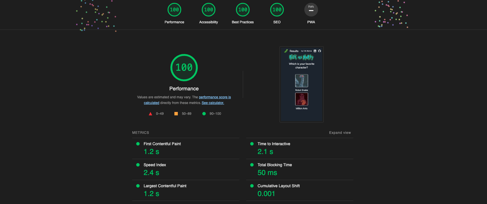

# Rick and Morty Poll

**Which is your favorite Rick and Morty character? Vote and see the current results.**



## Tech stack

- **NextJS:** The React Framework for Production.
- **TailwindCSS:** Rapidly build modern websites without ever leaving your HTML.
- **Prisma:** Next-generation Node.js and TypeScript ORM.
- **TRPC:** End-to-end typesafe APIs made easy :purple_heart:
- **AWS RDS with PostgreSQL**: The World's Most Advanced Open Source Relational Database.

## Quick start

Populate a PostgreSQL database with the correct data, you already have a script to do so in the **/scripts** folder.

Add the correct DATABASE_URL in the .env file.

Run the development server:

```bash
npm run dev
# or
yarn dev
```

Open [http://localhost:3000](http://localhost:3000) with your browser to see the result.


